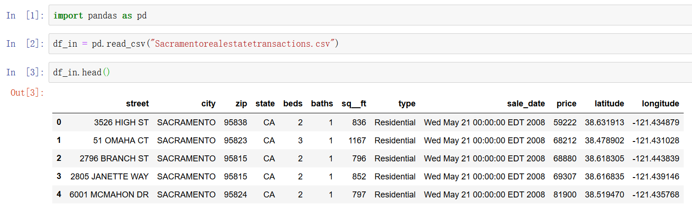
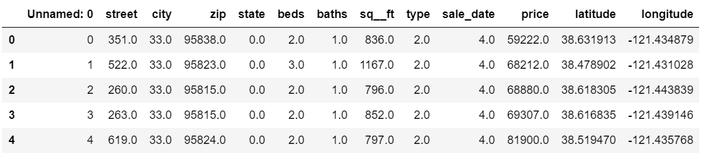

# Auto_Data_Transform

A script to transform .csv file (containing strings) to fully digital .csv file.

Like this:

> Input: Good, Bad, Good

> Output: 1, 0, 1 
 
> Input: 2019-01-01, 2019-01-02, 2019-01-03

> Output: 1, 2, 3

Usage: python auto_data_transform.py *target*.csv

OUT: *target_out*.csv

## Example 1

Here I download a sheet online, and it looks like this in *pandas*:

And after performing auto_data_transform, it will be like this:

Note: The date data form has been transfered into day_of_year

## Example 2

An input file like this,

And the output file will be like this,

All the categories/strings will be labeled to number, which is helpful to do machine learning directly. 

And use pd.read_csv("input.csv", index_col=0) to drop the "**Unnamed:0 col**".