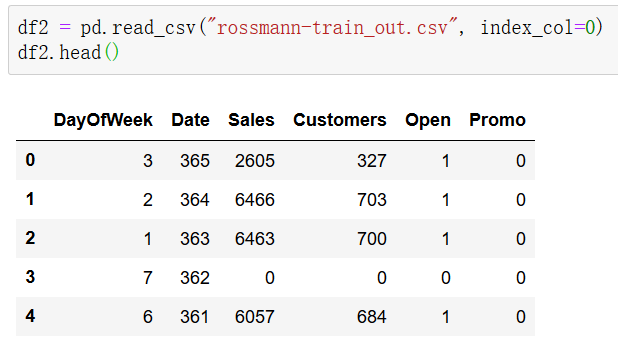

# Auto_Data_Transform
A script to transform .csv file (containing strings) to fully digital .csv

Usage: python python_data_interface.py *target*.csv

OUT: *target_out*.csv

## Example

Here I download a sheet online, and it looks like this:

And after performing auto_data_transform, it will be like this:

Also, emmm, here is an addtional column called Unnamed: 0, it's the auto order number.